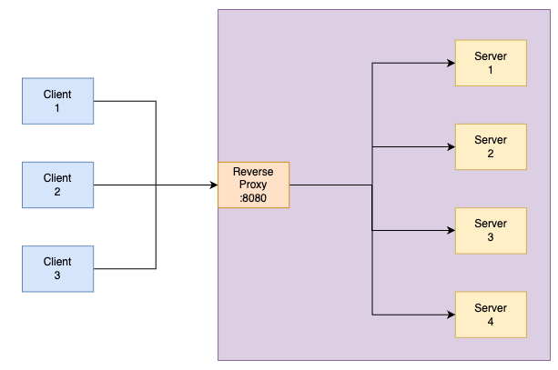

# Unikernel Proxy

In this project, we present an reverse proxy written and built for [unikraft](https://unikraft.org/). A reverse proxy is a service used to protect the identity of the servers from externel clients. We aim to provide authentication and load-balancing capabilities in this reverse proxy. The flow of this system will look like this: 



The clients on the left will only be able to communicate to the subsystem on the right via the reverse proxy (as only that port and host is exposed to the clients). 

Any request from the client must contain the authentication header 'X-Auth-Token'. 
Once the request is authenticated, the load balancing logic selects one of the servers available to the proxy and creates a connection with them. It then forwards the request from client to the server. After the server responds, the response is then read and sent to the client via client's fd. This way, the client never maintains a direct connection with the server. 


## How does the project build work?

Unikraft provides a tool called [Kraftkit](https://github.com/unikraft/kraftkit) for building the unikernel with a minimal filesystem using Docker. It uses Dockerfile with multi-stage builds to build the source application in the earlier stages and copies the build files from them into the last stage where the base image is `scratch`, a minimal image to run things. Once the build is done, the kraft tool copies the filesystem from the docker build into the .unikernel directory. These details can be found in the Dockerfile and the Kraftfile. 


## Our explorations for Go support in Unikraft 

The initial idea was to develop a build of unikraft that contains support for running Go programs and then use that to build the reverse proxy. The benefit of using this approach was to use the capabilities of Goroutines and fastpaths to better manage the working of the entire proxy. 

After a series of discussions with Jacob and others in the Discord channel, we concluded that using Go might be not fully supported for general use in Unikraft. 

### The provided examples are outdated
We started with the [http-go](https://github.com/unikraft/catalog/tree/main/examples/http-go1.21) example from the unikraft examples catalog. This example uses Kraftkit for building a minimal http server in Go using native library support. Though this seemed simple to work with on the first look, once we tried it out, it failed with an error saying 'pthread' is not supported. This was a major bummer for us as Goroutines use pthreads. 

We tried multiple versions of Kraftkit (updating and downgrading) -  `v0.18.0 (Helene)`, `v0.17.0 (Calypso)`, and `v0.16.3 (Telesto)`, but it did not work. 


### Without Kraftkit: app-helloworld-go, does not work


The [app-helloworld-go](https://github.com/unikraft/app-helloworld-go) example from unikraft has a minimal version of a `Hello World` Application which comes with built configurations for kraftkit. The kraftkit uses that to build the minimal version of unikraft that can support `Go`. This has numerous problems: 

1. The libraries in `kraft.yaml` are listed as follows: 

```yaml
libraries:
  gcc: '0.6'
  libgo: '0.6'
  pthread-embedded: '0.6'
  lwip: '0.6'
  compiler-rt: '0.6'
  libcxx: '0.6'
  libcxxabi: '0.6'
  libunwind: '0.6'
  libucontext: '0.6'
  newlib: '0.6'
```

This is completely wrong when compared with the documentation of [libgo](https://github.com/unikraft/lib-libgo/tree/stable). The libgo documentation mentions an order of including these libraries in the kraft.yaml file, which was not the case. The default branch in libgo is `staging`, which is currently on `0.6`. They have a stable version available to work with, and can be used by changing the library versions in the kraft.yaml file. 

2. The updated yaml file, according to libgo documentation looks like this:

```yaml
libraries:
  gcc: 'stable'
  compiler-rt: 'stable'
  libunwind: 'stable'
  musl: 'stable'
  lwip: 'stable'
  libgo: 'stable'
  pthread-embedded: 'stable'
  libcxx: 'stable'
  libcxxabi: 'stable'
  libunwind: 'stable'
  libucontext: 'stable'
  newlib: 'stable'
```
 
This too fails with a compilation error. 😭


### Some examples do work, but they do not have much documentation on how to repurpose them

What's confusing was that there are some applications in the unikraft catalog that are written in Go and work. But there is no way to repurpose them for our use. For example, [hugo](https://github.com/unikraft/catalog/tree/main/examples/hugo) is a tool written in Go for serving web pages and uses the `runtime: hugo:latest` for running the server. We tried to repurpose this tool in our work, to find a hack around using Go, but the default image of hugo did not come with a go binary, it just runs the hugo binary directly. We did try to change the filesystem by using the `go` docker image instead of `scratch`, but that defeats the purpose of building a specialized unikernel as it injects additional dependencies into the system that comes with the image. 


###  Conclusion 

In the end we decided that their documentation is outdated and needs rigorous testing before it can be used by others. So we resorted to trying out C in Unkiraft and built a minimal version of a server that can do `epoll`. This worked well, so we added additional functionalities to the rest of the work and tested it with multiple clients and servers. 